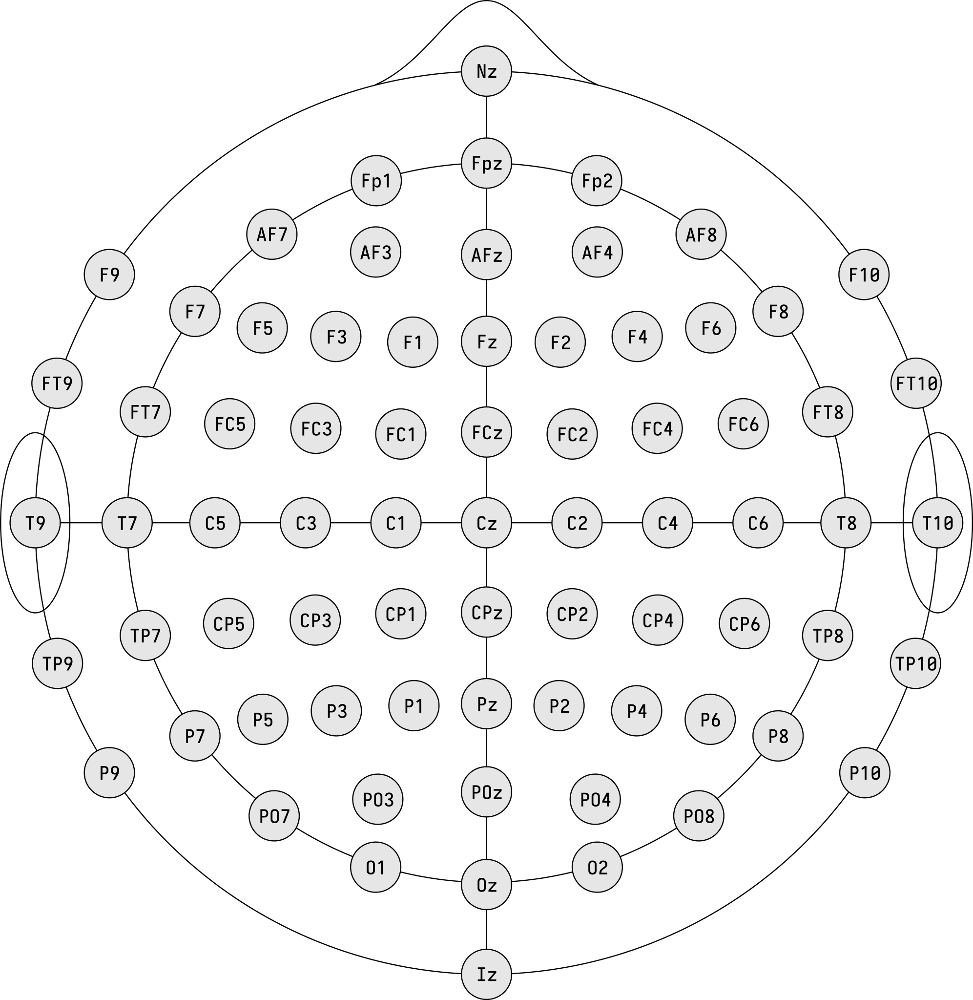
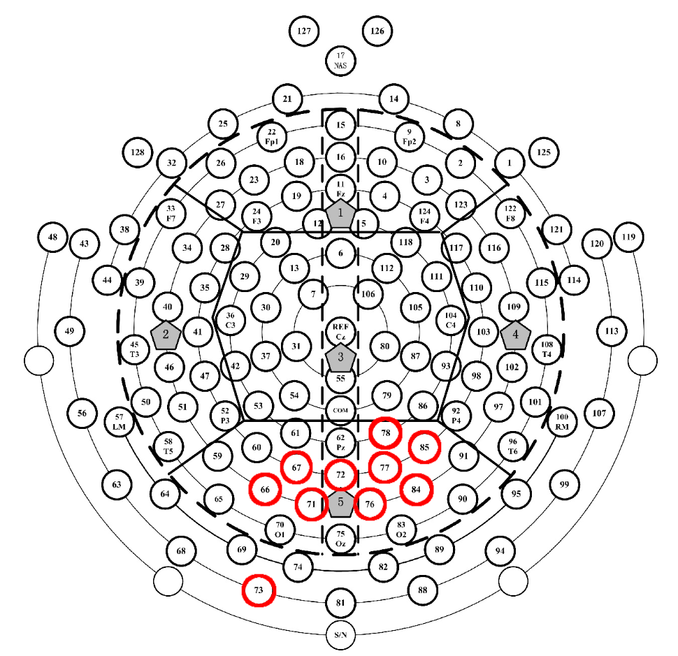

# How to run?
If you want to just blindly run everything, you need to:
- `python copy_data.py`
- `python raw_file_parser.py`
- `python preprocessing.py`
- `python FeatureExtractor.py`
- `python AgeClassifier.py`

The `AgeClassifier.py` file can optionally be run with a `--model-path` flag, which if supplied loads a model from the specified folder and runs it on the testing dataset. Otherwise, it will train, validate and test a new model which you will be prompted to save in the end.

## About the data - a guide for the uninitiated
All the annotated data is located in `\\felles.ansatt.ntnu.no\ntnu\su\ips\nullab\Analysis\EEG\Looming\Silje-Adelen\3. BCI Annotation (Silje-Adelen)\1. Infant VEP Annotations\1 )Annotated_Silje`. The file `1 Final_Annotations_Silje (3).xlsx` gives specifics on all the annotations - whether it's done and the number of peaks found in the raw file.

The way it's structured, each of the subfolders is divided into infants older than 7 months and younger than 7 months at the time of testing. For each infant, what's relevant for our analysis are the `.raw` file and the `.evt` file. The amazing Silje-Adelen has been so kind as to annotate all the peaks she saw in these files, and the annotations are a part of the .evt file. In the `Comnt` column, each occurence of `oz` or `pz` signifies a peak in the Pz or Oz electrode in the 10-10 system. A schematic of the 10-10 electrode system is shown below:

while the full 128 electrodes with numbering are on the below image:

The electrodes circled in red are the ones included in the feature extraction pipeline as of 18.05.2024 (which is almost guaranteed to be changed soon(TM)).

Before getting to the actual step of training a classifier, the data needs to be copied from the file server, preprocessed, split into training, validation and testing datasets, and from these, specific features must be extracted.

Currently, 54 features are extracted, and these are, in no particular order:
- **Time Domain Features**  
    01. Root Mean Square
    02. Median
    03. Standard Deviation
    04. Variance
    05. Maximum Value
    06. Minimum Value
    07. Positive Peak Amplitude
    08. Positive Peak Latency
    09. Positive Peak Duration (Peak Width)
    10. Positive Peak Prominence
    11. Negative Peak Amplitude
    12. Negative Peak Latency
    13. Negative Peak Duration (Peak Width)
    14. Negative Peak Prominence
    15. [Fractional Area Latency](https://socialsci.libretexts.org/Bookshelves/Psychology/Biological_Psychology/Applied_Event-Related_Potential_Data_Analysis_(Luck)/10%3A_Scoring_and_Statistical_Analysis_of_ERP_Amplitudes_and_Latencies/10.08%3A_Exercise-_Fractional_Area_Latency)
    16. Fractional Area Duration
    17. Number of Sign Changes (Zero Crossings)
    18. z-score
    19. [Hjorth Mobility](https://bio-protocol.org/exchange/minidetail?id=9709079&type=30)
    20. Hjorth Activity
    21. [Petrosian Fractal Dimension](https://www.seas.upenn.edu/~littlab/Site/Publications_files/Esteller_2001.pdf),
- **Frequency Domain**  
    22. Bandpower  
    23. Phase Difference Mean (this and the below are computed in reference to what currently seems to me to be a random set of electrodes)  
    24. Phase Difference Standard Deviation  
- **Time Frequency Domain**  
    25. Mean Spectral Entropy  
    26. Mean Instataneous Frequency  
- **Power Domain**  
    - 28 features on the form sxx_f{frequency}_t{time} representing spectrogram values at a given frequency and given timepoint.  

## How to improve models?
While I was working on the classifier, I based my work on what was detected by the model trained by Swati and Vegard. A *big* setback to the model is that it only uses the occipital and parietal electrodes when training their model. See my pdf report from PSY8005 for a better explanation as to why, but in essence, one should aim to include both these and the prefrontal electrodes to make the model better.

The very next step would be to do an optimality analysis to pick out the most relevant electrodes for both classification problems, and not just rely on what we think we know. After this, look into multivariate EMD and VMD to generate more features. These aren't trivial to do, but should lead to substantial improvement in both models. Analyse feature importance more to remove features that are actively hindering model improvement.